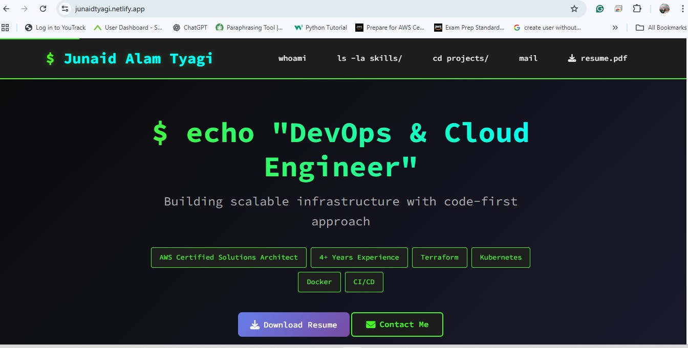
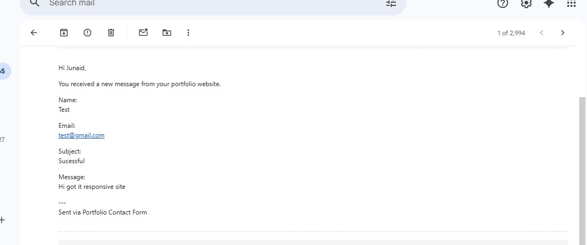
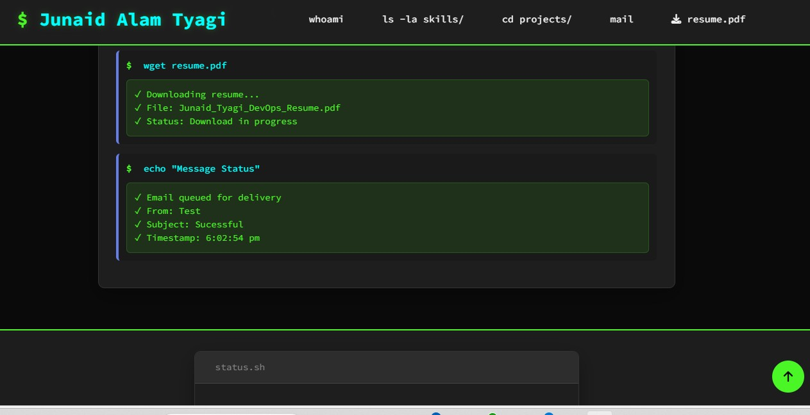

# DevOps Portfolio ⚡



A terminal-themed portfolio showcasing 4+ years of DevOps & Cloud engineering expertise. Fully responsive with working contact form and resume download.

🔗 **Live:** [junaidtyagi.netlify.app](https://junaidtyagi.netlify.app)

## ✨ Features

- **Terminal UI** - Command-line interface with animations
- **Mobile-First** - Responsive design for all devices
- **Email Integration** - Contact form powered by EmailJS
- **PDF Resume** - One-click download functionality
- **Performance** - Optimized loading & SEO ready

## 🛠️ Tech Stack

**Frontend:** HTML5, CSS3, JavaScript  
**Services:** EmailJS, Google Drive  
**DevOps Tools:** AWS, Docker, Kubernetes, Terraform, Jenkins

## 📸 Screenshots

| Description | Screenshot |
|--------------|-------------|
| Gmail(message) |  |
| web(notificatio) |  |

## 🚀 Quick Start

```bash
git clone https://github.com/junaidtyagi9555/devops-portfolio.git
open index.html
